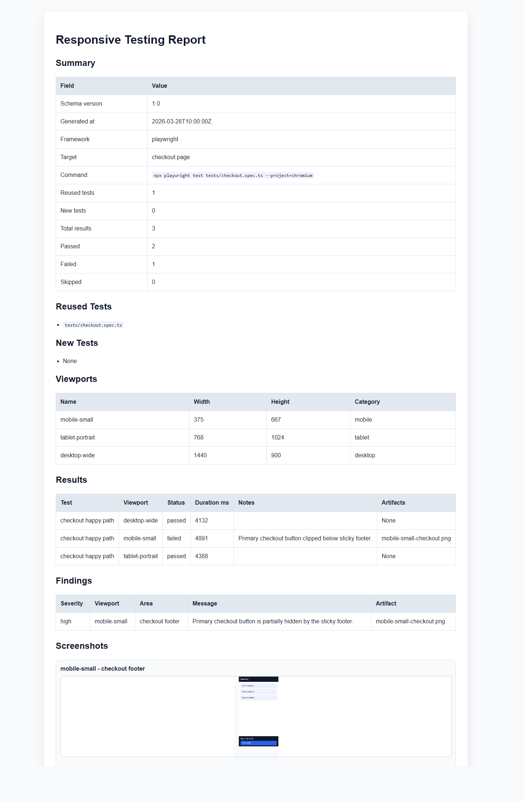

# responsive-testing

[](LICENSE)

Responsive testing skill for AI agents that need to inspect an existing frontend test stack, reuse or extend the right tests across multiple viewport classes, and generate normalized responsive testing reports for engineering and CI workflows.


[](https://buymeacoffee.com/jovd83)
[](https://github.com/jovd83/responsive-testing/actions/workflows/ci.yml)

## Why This Skill Exists

Most responsive testing guidance is either too generic to be reliable or too framework-specific to be portable. This skill gives an agent a disciplined workflow for:

- finding reusable frontend tests before generating new ones
- selecting an appropriate viewport matrix
- extending Playwright or Cypress coverage without cloning entire suites
- validating responsive behavior with behavioral assertions instead of screenshot-only checks
- producing normalized reports in `json`, `markdown`, and `html`
- embedding screenshot evidence directly into generated reports when image artifacts are available
- requiring screenshot evidence for every executed viewport result, not only failures
- aggregating shallow, deep, and edge-case scans into one overview report that links to individual bundles
- embedding screenshot thumbnails in the overview so a reviewer can navigate child reports faster

The result is a skill that is useful both for one-off agent tasks and for repeatable repository workflows.

## What The Skill Is Responsible For

- Detecting the current frontend test framework from repository evidence
- Reusing or extending existing frontend tests wherever practical
- Selecting a right-sized responsive test matrix
- Guiding responsive assertion strategy and execution scope
- Producing structured responsive testing reports

## What The Skill Is Not Responsible For

- Creating a brand-new frontend automation stack unless the user explicitly asks for that
- Solving browser-compatibility matrices beyond viewport and device-class concerns
- Acting as shared-memory infrastructure across repositories or teams
- Replacing product-specific breakpoint policy or design-system documentation

## Repository Layout

```text
responsive-testing/
├── SKILL.md
├── README.md
├── CHANGELOG.md
├── LICENSE
├── CONTRIBUTING.md
├── .gitignore
├── .github/
│   └── workflows/
│       ├── release.yml
│       └── validate.yml
├── agents/
│   └── openai.yaml
├── assets/
│   ├── report-preview.png
│   ├── report-template.md
│   └── report-template.html
├── examples/
│   ├── README.md
│   ├── cypress-responsive-example.cy.ts
│   ├── generated/
│   ├── playwright-responsive-example.ts
│   └── sample-report-input.json
├── references/
│   ├── framework-detection.md
│   ├── viewport-strategy.md
│   ├── reporting-format.md
│   └── evaluation.md
├── schemas/
│   └── responsive-report.schema.json
└── scripts/
    ├── generate_responsive_overview.py
    └── generate_responsive_report.py
```

## Preview

Generated HTML report preview:



## Quick Start

1. Install or copy the skill into an Agent Skills-compatible directory.
2. Trigger it with a prompt such as:
   - `Add responsive coverage for checkout and generate a markdown report.`
   - `Audit our Playwright suite for responsive readiness.`
   - `Run the dashboard flow across mobile, tablet, and desktop and output json plus html.`
3. Let the agent search the repository for existing tests before creating new ones.
4. Use the bundled script to render consistent reports from normalized JSON.

## Report Generation

Generate reports from a normalized JSON input:

```powershell
python scripts/generate_responsive_report.py `
  --input examples\sample-report-input.json `
  --format json md html `
  --output-dir artifacts
```

Optional flags:

- `--template assets/report-template.md`
- `--html-template assets/report-template.html`
- `--basename responsive-report`
- `--strict` to require valid report structure and screenshot evidence for every executed result

Machine-readable validation contract:

- `schemas/responsive-report.schema.json`

Generate an overview report from multiple scan bundles:

```powershell
python scripts/generate_responsive_overview.py `
  --inputs `
    artifacts\pst-responsive-audit\practicesoftwaretesting-responsive-audit.json `
    artifacts\pst-deep-responsive-audit\practicesoftwaretesting-deep-responsive-audit.json `
    artifacts\pst-edge-responsive-audit\practicesoftwaretesting-edge-responsive-audit.json `
  --output-dir artifacts\pst-overview `
  --basename practicesoftwaretesting-overview
```

The overview bundle now:

- groups and labels scan types more cleanly as `shallow`, `deep`, and `edge`
- uses web-safe relative links for Markdown and HTML navigation
- surfaces screenshot thumbnail previews for each child report
- keeps the individual report bundles intact as the source of truth

## Installation Notes

This repository follows the Agent Skills folder convention and keeps the core workflow in `SKILL.md` with progressive disclosure into `references/`, `scripts/`, and `assets/`.

Helpful specification and best-practice references:

- Agent Skills specification: https://agentskills.io/specification
- Best practices for skill creators: https://agentskills.io/skill-creation/best-practices
- Using scripts in skills: https://agentskills.io/skill-creation/using-scripts

## Skill Design Highlights

- Repository-first workflow instead of test-generation-first behavior
- Framework-aware reuse guidance for Playwright and Cypress
- Explicit guardrails against screenshot-only testing and full-suite matrix explosion
- Deliberate memory boundaries:
  - runtime memory for current analysis and findings
  - project-local persistence only when the repository already supports it
  - no embedded shared-memory infrastructure
- Deterministic report generation from one normalized JSON source of truth

## Optional Integrations

These are optional and not required for the current implementation:

- repository-specific breakpoint sources such as Tailwind config or design tokens
- CI pipelines that publish generated `html` reports as artifacts
- external shared-memory skills for cross-project testing conventions
- repository-local validation scripts that produce normalized JSON directly

## Examples

Use [examples/sample-report-input.json](examples/sample-report-input.json) as a demo input for report generation and contract validation.

## Validation And Quality

- `python -m py_compile scripts/generate_responsive_report.py`
- `python scripts/generate_responsive_report.py --input examples/sample-report-input.json --format json md html --output-dir artifacts --strict`
- validate `examples/sample-report-input.json` against `schemas/responsive-report.schema.json`

GitHub Actions included:

- `.github/workflows/validate.yml`: compile, schema validation, and sample report generation on push and pull request
- `.github/workflows/release.yml`: validates, packages, and publishes release assets on version tags

Generated sample outputs are tracked in `examples/generated/`.

For broader evaluation ideas, read [references/evaluation.md](references/evaluation.md).

## Maintainer

Maintained by `jovd:83`.
