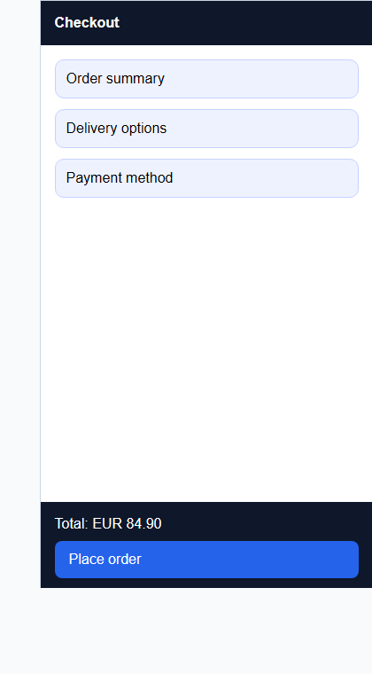

# Responsive Testing Report

## Summary

- Schema version: 1.0
- Generated at: 2026-03-28T10:00:00Z
- Framework: playwright
- Target: checkout page
- Command: npx playwright test tests/checkout.spec.ts --project=chromium
- Reused tests: 1
- New tests: 0
- Total results: 3
- Passed: 2
- Failed: 1
- Skipped: 0

## Reused Tests

- tests/checkout.spec.ts

## New Tests

- None

## Viewports

- mobile-small: 375x667 (mobile)
- tablet-portrait: 768x1024 (tablet)
- desktop-wide: 1440x900 (desktop)

## Results

- [passed] checkout happy path @ desktop-wide | duration_ms: 4132 | artifacts: desktop-wide-checkout.png | notes: Desktop checkout layout remained stable and primary actions stayed visible.
- [failed] checkout happy path @ mobile-small | duration_ms: 4891 | artifacts: mobile-small-checkout.png | notes: Primary checkout button clipped below sticky footer.
- [passed] checkout happy path @ tablet-portrait | duration_ms: 4388 | artifacts: tablet-portrait-checkout.png | notes: Tablet checkout layout remained stable and form sections stayed visible.

## Findings

- [high] mobile-small | checkout footer | Primary checkout button is partially hidden by the sticky footer. | artifact: mobile-small-checkout.png

## Screenshots

### desktop-wide - checkout happy path

Desktop checkout layout remained stable and primary actions stayed visible.

### mobile-small - checkout happy path

Primary checkout button clipped below sticky footer.

### tablet-portrait - checkout happy path

Tablet checkout layout remained stable and form sections stayed visible.

## Artifacts

- desktop-wide-checkout.png
- mobile-small-checkout.png
- tablet-portrait-checkout.png

## Next Actions

- Adjust the sticky footer layout for narrow mobile widths.
- Rerun checkout responsive coverage after the layout fix.
